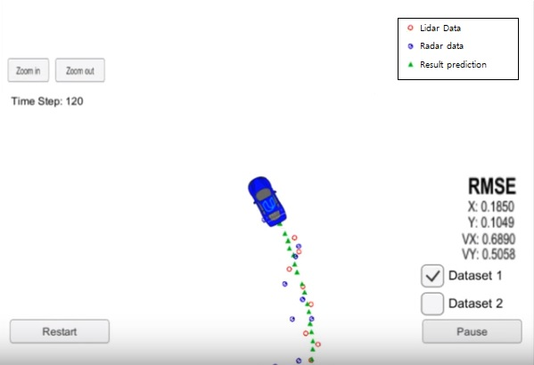

## Extended Kalman Filter Project

Overview:
---

Project #6 from the Udacity Self-Driving Car program (SDC). This project is part of the Sensor Fusion content in which sensor data received from a Lidar and a Radar is processed according to its type by the same algorithm. The project implements the basics of an Extended Kalman Filter (EKF) for tracking a moving object in the road, by using sensor information from both lidar and radar we can predict the objects position and speed with good accuracy.

Tools and Techniques:
---

* Implementd in C++
* Sensor Fusion techniques
* Simulator* for results visualization

Reflections:
---

The heavy mathematics and theory behind Kalman Filter can be quite daunting at the beggining, but by skipping the fine details and with some simplifiactions it is not as hard to implement the code.

Radar and lidar data, altough different in nature, can be processed and combined in a Kalman filter to achieve the same purpose, object tracking.
What is special about the kalman filter is that we can use the results to predict information about the object, even though we can not directly measure it with the sensors, such as speed.